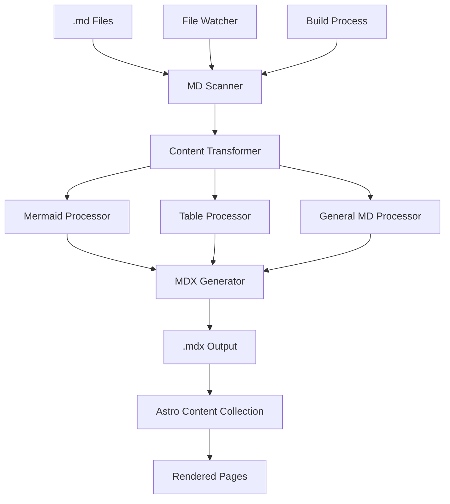

# Design Document

## Overview

The MD to MDX compilation system will create a seamless bridge between standard Markdown files and Astro's MDX processing capabilities. The system will automatically detect, transform, and compile .md files into .mdx format during the build process, with special handling for mermaid diagrams and enhanced table styling.

## Architecture

### High-Level Architecture



### Component Architecture

The system will consist of several key components:

1. **MD Scanner**: Discovers and monitors .md files
2. **Content Transformer**: Orchestrates the transformation process
3. **Specialized Processors**: Handle specific Markdown elements
4. **MDX Generator**: Creates properly formatted .mdx files
5. **File Watcher**: Handles development mode hot reloading

## Components and Interfaces

### 1. MD Scanner (`src/build/md-scanner.js`)

**Purpose**: Discover and monitor .md files in the content directory

**Interface**:
```javascript
class MDScanner {
  constructor(contentDir, options = {})
  async scanFiles()
  watchFiles(callback)
  getFileList()
}
```

**Responsibilities**:
- Recursively scan content directories for .md files
- Filter out files that shouldn't be processed
- Provide file watching capabilities for development
- Handle file system events (create, modify, delete)

### 2. Content Transformer (`src/build/content-transformer.js`)

**Purpose**: Orchestrate the transformation of .md content to .mdx format

**Interface**:
```javascript
class ContentTransformer {
  constructor(processors = [])
  async transform(filePath, content)
  addProcessor(processor)
  removeProcessor(processorName)
  preserveStandardMarkdown(content)
}
```

**Responsibilities**:
- Parse frontmatter and content separately
- Apply specialized processors only to targeted elements
- Preserve all standard Markdown syntax (headers, lists, links, emphasis, code blocks, etc.)
- Maintain content integrity during transformation
- Ensure non-targeted elements pass through unchanged
- Handle errors gracefully with detailed reporting

### 3. Mermaid Processor (`src/build/processors/mermaid-processor.js`)

**Purpose**: Transform ```mermaid code blocks into <Mermaid> component syntax

**Interface**:
```javascript
class MermaidProcessor {
  constructor(options = {})
  process(content, metadata)
  validateMermaidSyntax(code)
  generateComponentSyntax(code, title)
}
```

**Responsibilities**:
- Detect mermaid code blocks using regex patterns
- Validate mermaid syntax before transformation
- Generate proper MDX component syntax
- Preserve code formatting and handle edge cases

### 4. Math Processor (`src/build/processors/math-processor.js`)

**Purpose**: Transform LaTeX math expressions into proper MDX format compatible with KaTeX

**Interface**:
```javascript
class MathProcessor {
  constructor(options = {})
  process(content, metadata)
  processInlineMath(content)
  processDisplayMath(content)
  validateLatexSyntax(expression)
  escapeForMDX(mathExpression)
}
```

**Responsibilities**:
- Detect inline math expressions (`$...$`) and display math blocks (`$$...$$`)
- Preserve LaTeX syntax while ensuring MDX compatibility
- Handle edge cases like escaped dollar signs and nested expressions
- Validate LaTeX syntax to prevent rendering errors
- Convert to format compatible with remark-math and KaTeX

### 5. Table Processor (`src/build/processors/table-processor.js`)

**Purpose**: Ensure Markdown tables are properly formatted for enhanced styling

**Interface**:
```javascript
class TableProcessor {
  constructor(options = {})
  process(content, metadata)
  enhanceTableSyntax(tableMarkdown)
  addResponsiveAttributes(table)
}
```

**Responsibilities**:
- Detect and parse Markdown tables only
- Add CSS classes for enhanced styling
- Ensure mobile responsiveness attributes
- Preserve table content and structure
- Leave all other Markdown elements unchanged

### 6. Standard Markdown Processor (`src/build/processors/standard-processor.js`)

**Purpose**: Ensure all standard Markdown elements are preserved and pass through correctly

**Interface**:
```javascript
class StandardProcessor {
  constructor(options = {})
  process(content, metadata)
  validateMarkdownSyntax(content)
  preserveStandardElements(content)
}
```

**Responsibilities**:
- Preserve headers (# ## ### etc.)
- Preserve lists (ordered and unordered)
- Preserve links and images
- Preserve emphasis (bold, italic, strikethrough)
- Preserve code blocks and inline code (non-mermaid)
- Preserve blockquotes and horizontal rules
- Preserve line breaks and paragraphs
- Ensure proper MDX compatibility for standard elements

### 7. MDX Generator (`src/build/mdx-generator.js`)

**Purpose**: Generate properly formatted .mdx files from transformed content

**Interface**:
```javascript
class MDXGenerator {
  constructor(outputDir, options = {})
  async generate(filePath, frontmatter, content)
  ensureOutputDirectory(filePath)
  writeFile(outputPath, mdxContent)
}
```

**Responsibilities**:
- Combine frontmatter and transformed content
- Generate proper MDX file structure
- Handle file writing with error handling
- Maintain file permissions and metadata

### 8. Build Integration (`src/build/md-to-mdx-plugin.js`)

**Purpose**: Integrate the compilation process with Astro's build system

**Interface**:
```javascript
function createMDToMDXPlugin(options = {}) {
  return {
    name: 'md-to-mdx-compiler',
    buildStart(),
    buildEnd(),
    handleHotUpdate(ctx)
  }
}
```

**Responsibilities**:
- Hook into Astro's build lifecycle
- Trigger compilation at appropriate times
- Handle development mode file watching
- Provide build progress feedback

## Data Models

### File Metadata
```javascript
{
  filePath: string,           // Original .md file path
  outputPath: string,         // Target .mdx file path
  lastModified: Date,         // File modification time
  frontmatter: object,        // Parsed frontmatter
  contentHash: string,        // Content hash for change detection
  processingStatus: string    // 'pending' | 'processing' | 'complete' | 'error'
}
```

### Transformation Context
```javascript
{
  sourceFile: string,         // Original file path
  content: string,           // File content
  frontmatter: object,       // Parsed frontmatter
  metadata: FileMetadata,    // File metadata
  options: object,           // Processing options
  errors: Array<string>,     // Processing errors
  warnings: Array<string>   // Processing warnings
}
```

### Processor Configuration
```javascript
{
  name: string,              // Processor identifier
  enabled: boolean,          // Whether processor is active
  priority: number,          // Processing order (lower = earlier)
  options: object,           // Processor-specific options
  patterns: Array<RegExp>    // Content patterns to match
}
```

## Error Handling

### Error Categories

1. **File System Errors**
   - File not found
   - Permission denied
   - Disk space issues

2. **Content Processing Errors**
   - Invalid frontmatter syntax
   - Malformed Markdown
   - Invalid mermaid syntax

3. **Build Integration Errors**
   - Astro build conflicts
   - Plugin initialization failures
   - Hot reload issues

### Error Handling Strategy

```javascript
// Error handling with detailed context
try {
  await transformer.transform(filePath, content);
} catch (error) {
  const contextualError = new ProcessingError({
    message: error.message,
    file: filePath,
    line: error.line,
    column: error.column,
    processor: error.processor,
    originalError: error
  });
  
  logger.error(contextualError);
  // Continue processing other files
}
```

### Error Recovery

- **Graceful Degradation**: If mermaid processing fails, preserve original code block
- **Partial Processing**: Continue with other files if one file fails
- **Development Feedback**: Show errors in browser console during development
- **Build Warnings**: Log warnings for non-critical issues

## Testing Strategy

### Unit Tests

1. **MD Scanner Tests**
   - File discovery accuracy
   - File watching functionality
   - Filter logic validation

2. **Content Transformer Tests**
   - Processor orchestration
   - Error handling
   - Content integrity

3. **Processor Tests**
   - Standard Markdown element preservation (headers, lists, links, emphasis, code blocks)
   - Mermaid code block detection and transformation
   - Math expression processing (inline and display)
   - LaTeX syntax validation and error handling
   - Table processing accuracy
   - Mixed content handling (standard + special elements)
   - Edge case handling

4. **MDX Generator Tests**
   - File output correctness
   - Frontmatter preservation
   - Directory structure creation

### Integration Tests

1. **End-to-End Compilation**
   - Complete .md to .mdx transformation
   - Astro build integration
   - Content collection compatibility

2. **Development Workflow**
   - Hot reload functionality
   - File watching accuracy
   - Error reporting in development

3. **Build Process**
   - Production build integration
   - Performance impact measurement
   - Output file validation

### Test Data

Create comprehensive test fixtures including:
- Simple Markdown files with standard elements (headers, lists, links, emphasis)
- Files with code blocks (both regular and mermaid)
- Complex files with mermaid diagrams
- Files with mathematical expressions (inline and display)
- Files with tables and mixed content
- Files combining standard Markdown with special elements
- Edge cases (empty files, malformed content, escaped math delimiters)
- Files with various frontmatter configurations
- Files testing all Markdown syntax combinations

## Performance Considerations

### Optimization Strategies

1. **Incremental Processing**
   - Only process changed files
   - Use content hashing for change detection
   - Cache transformation results

2. **Parallel Processing**
   - Process multiple files concurrently
   - Use worker threads for CPU-intensive tasks
   - Implement processing queues

3. **Memory Management**
   - Stream large files instead of loading entirely
   - Clean up temporary data structures
   - Implement garbage collection hints

### Performance Monitoring

```javascript
// Performance tracking
const startTime = performance.now();
await transformer.transform(filePath, content);
const duration = performance.now() - startTime;

metrics.record('md_transformation_duration', duration, {
  fileSize: content.length,
  processorCount: processors.length
});
```

## Configuration

### Default Configuration

```javascript
const defaultConfig = {
  // Input/Output paths
  contentDir: 'src/content',
  outputDir: 'src/content',
  
  // File patterns
  include: ['**/*.md'],
  exclude: ['**/node_modules/**', '**/.git/**'],
  
  // Processing options
  processors: {
    standard: {
      enabled: true,
      preserveAllElements: true,
      validateSyntax: true
    },
    mermaid: {
      enabled: true,
      componentPath: '../../components/Mermaid.astro',
      validateSyntax: true
    },
    math: {
      enabled: true,
      inlineDelimiters: ['$', '$'],
      displayDelimiters: ['$$', '$$'],
      validateLatex: true,
      preserveEscapes: true
    },
    tables: {
      enabled: true,
      addResponsiveClasses: true,
      enhancedStyling: true
    }
  },
  
  // Development options
  watch: true,
  hotReload: true,
  
  // Build options
  cleanOutput: false,
  preserveTimestamps: true
};
```

### User Configuration

Users can override defaults through:
- `astro.config.mjs` plugin options
- `.mdxrc.js` configuration file
- Environment variables for CI/CD

## Security Considerations

### Input Validation

- Sanitize file paths to prevent directory traversal
- Validate frontmatter content to prevent code injection
- Limit file sizes to prevent memory exhaustion

### Content Security

- Escape user content appropriately
- Validate mermaid syntax to prevent XSS
- Sanitize HTML content in Markdown

### File System Security

- Restrict file operations to designated directories
- Validate file permissions before writing
- Handle symbolic links securely

## Deployment Strategy

### Development Integration

1. Add plugin to `astro.config.mjs`
2. Configure processors as needed
3. Start development server with file watching

### Production Build

1. Run compilation during build process
2. Generate optimized .mdx files
3. Clean up temporary files
4. Validate output integrity

### CI/CD Integration

```yaml
# Example GitHub Actions step
- name: Compile MD to MDX
  run: |
    npm run build:md-to-mdx
    npm run build
```

This design provides a robust, scalable solution for automatically transforming Markdown files to MDX format while preserving content integrity and enabling enhanced features like interactive mermaid diagrams and styled tables.