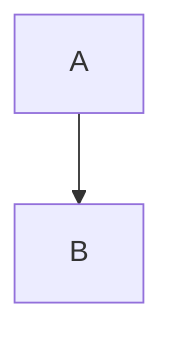

# Design Document

## Overview

This design implements comprehensive Typora-compatible MDX processing by creating custom remark plugins that handle Typora's specific markdown features. This includes ```mermaid code blocks, image path resolution, table enhancements, task lists, highlight syntax, footnotes, and other Typora-specific markdown extensions. The solution maintains backward compatibility while enabling seamless content creation in Typora.

## Architecture

### Current System
- Astro processes both .md and .mdx files using @astrojs/mdx integration
- Mermaid diagrams are manually imported and used as components: `<Mermaid code={...} />`
- Images are referenced with absolute paths or relative to public directory
- remark-gfm and remark-math plugins handle GitHub Flavored Markdown and math
- Math rendering uses KaTeX via rehype-katex for both inline ($...$) and block ($$...$$) math

### Proposed System
- Custom remark plugin `remark-typora-mermaid` transforms ```mermaid code blocks to Mermaid components
- Custom remark plugin `remark-typora-images` resolves image paths with Typora's conventions
- Custom remark plugin `remark-typora-extensions` handles Typora-specific syntax:
  - Highlight syntax: `==highlighted text==`
  - Underline syntax: `<u>underlined text</u>`
  - Strikethrough enhancements
  - Task list improvements
  - Table enhancements with alignment
  - Footnote processing
  - Enhanced math block processing (Typora's LaTeX extensions)
  - Code fence enhancements
- Enhanced math processing for both .md and .mdx files:
  - Inline math: `$E = mc^2$`
  - Block math: `$$\int_{-\infty}^{\infty} e^{-x^2} dx = \sqrt{\pi}$$`
  - Typora's math shortcuts and extensions
- Maintains existing functionality while adding comprehensive Typora compatibility
- All plugins are configurable and can be disabled individually
- Works seamlessly with both .md and .mdx file types

## Components and Interfaces

### 1. Remark Plugin: remark-typora-mermaid

**Purpose**: Transform ```mermaid code blocks into Mermaid component imports and usage

**Input**: 
```markdown

```

**Output**: 
```mdx
import Mermaid from "../../components/Mermaid.astro";

<Mermaid code={`graph TD
    A --> B`} />
```

**Note**: The import statement is automatically added to the top of the file during compilation, so users don't need to manually add it to their markdown files.

**Interface**:
```typescript
interface TyporaMermaidOptions {
  componentPath?: string; // Path to Mermaid component (default: "../../components/Mermaid.astro")
  wrapInFigure?: boolean; // Whether to wrap in figure element
  preserveCodeBlock?: boolean; // Keep original code block for editing
  autoImport?: boolean; // Automatically add import statement (default: true)
}

function remarkTyporaMermaid(options?: TyporaMermaidOptions): Plugin
```

### 2. Remark Plugin: remark-typora-images

**Purpose**: Transform image references using Typora's asset management conventions

**Typora Image Handling**:
- Relative paths: ``
- Automatic asset folders: ``
- Drag-and-drop image insertion
- Image resizing syntax: ``

**Input**: 
```markdown


```

**Output** (for blog post `my-post.md`):
```markdown


```

**Interface**:
```typescript
interface TyporaImageOptions {
  contentDir?: string; // Base content directory (default: "src/content/blog")
  preserveZoom?: boolean; // Preserve Typora zoom styling (default: true)
}

function remarkTyporaImages(options?: TyporaImageOptions): Plugin
```

### 3. Remark Plugin: remark-typora-extensions

**Purpose**: Handle Typora-specific markdown extensions

**Supported Typora Features**:

#### Highlight Syntax
```markdown
==highlighted text==
```
Transforms to: `<mark>highlighted text</mark>`

#### Underline Syntax
```markdown
<u>underlined text</u>
```
Preserves HTML underline tags

#### Enhanced Task Lists
```markdown
- [x] Completed task
- [ ] Incomplete task
- [?] Uncertain task (Typora extension)
```

#### Table Enhancements
```markdown
| Left | Center | Right |
|:-----|:------:|------:|
| L1   |   C1   |    R1 |
```
Enhanced with better alignment and styling

#### Footnotes
```markdown
Here's a sentence with a footnote[^1].

[^1]: This is the footnote content.
```

#### Math Block Improvements
```markdown
$$
E = mc^2
$$

$E = mc^2$ (inline math)

$$\begin{align}
F &= ma \\
E &= mc^2 \\
P &= \frac{dE}{dt}
\end{align}$$
```
Enhanced LaTeX rendering with Typora compatibility:
- Support for Typora's math shortcuts
- Enhanced equation numbering
- Better alignment handling
- Typora-specific LaTeX extensions

#### Code Fence Enhancements
```markdown
```python {.line-numbers}
def hello():
    print("Hello, World!")
```
```
Support for Typora's code fence attributes

**Interface**:
```typescript
interface TyporaExtensionOptions {
  enableHighlight?: boolean; // Enable ==text== highlighting
  enableUnderline?: boolean; // Enable <u> tags
  enableTaskLists?: boolean; // Enhanced task list support
  enableFootnotes?: boolean; // Footnote processing
  enableMathBlocks?: boolean; // Enhanced math rendering
  enableCodeAttributes?: boolean; // Code fence attributes
  highlightClassName?: string; // CSS class for highlights
}

function remarkTyporaExtensions(options?: TyporaExtensionOptions): Plugin
```

### 4. Enhanced Astro Configuration

**Purpose**: Integrate new plugins into MDX processing pipeline

```typescript
// astro.config.mjs
import { 
  remarkTyporaMermaid, 
  remarkTyporaImages, 
  remarkTyporaExtensions 
} from './src/plugins/remark-typora-plugins.js';

export default defineConfig({
  integrations: [
    mdx({
      remarkPlugins: [
        remarkGfm,
        remarkMath,
        [remarkTyporaMermaid, { 
          componentPath: "../../components/Mermaid.astro",
          preserveCodeBlock: false,
          autoImport: true // Automatically add import statement
        }],
        [remarkTyporaImages, { 
          contentDir: "src/content/blog",
          assetFolderName: "auto", // Use post name
          preserveZoom: true 
        }],
        [remarkTyporaExtensions, {
          enableHighlight: true,
          enableUnderline: true,
          enableTaskLists: true,
          enableFootnotes: true,
          enableMathBlocks: true,
          enableCodeAttributes: true,
          highlightClassName: "typora-highlight"
        }]
      ],
      rehypePlugins: [
        rehypeKatex,
        // Add custom rehype plugin for Typora-specific HTML processing
        rehypeTyporaEnhancements
      ]
      // ... other config
    })
  ]
});
```

### 5. Rehype Plugin: rehype-typora-enhancements

**Purpose**: Post-process HTML for Typora-specific features

```typescript
interface RehypeTyporaOptions {
  enhanceImages?: boolean; // Add responsive image classes
  enhanceTables?: boolean; // Add table styling classes
  enhanceCodeBlocks?: boolean; // Add code block enhancements
}

function rehypeTyporaEnhancements(options?: RehypeTyporaOptions): Plugin
```

## Data Models

### File Structure Convention (Simplified)
```
src/content/blog/
├── my-blog-post.md         # Markdown file
├── my-blog-post/           # Asset folder (same name as markdown file)
│   ├── image1.png
│   ├── diagram.jpg
│   └── screenshot.webp
├── another-post.md
└── another-post/
    ├── cover.jpg
    └── chart.svg
```

### Plugin Processing Context
```typescript
interface TyporaProcessingContext {
  filePath: string;        // Current markdown file path
  fileName: string;        // File name without extension
  contentDir: string;      // Base content directory
  assetDir: string;        // Corresponding asset directory
  imports: Set<string>;    // Track component imports (automatically managed)
  hasMermaidBlocks: boolean; // Whether file contains mermaid blocks
  needsMermaidImport: boolean; // Whether to add Mermaid import
}
```

### Image Resolution Strategy
```typescript
interface TyporaImageResolution {
  originalSrc: string;     // Original image source
  resolvedSrc: string;     // Resolved image path
  exists: boolean;         // Whether resolved file exists
  fallbackUsed: boolean;   // Whether fallback was used
  typoraZoom?: string;     // Typora zoom percentage
  isResponsive: boolean;   // Whether to make responsive
}
```

### Typora Feature Detection
```typescript
interface TyporaFeatures {
  hasHighlights: boolean;     // Contains ==text==
  hasUnderlines: boolean;     // Contains <u>text</u>
  hasMermaidBlocks: boolean;  // Contains ```mermaid
  hasTaskLists: boolean;      // Contains - [x] tasks
  hasFootnotes: boolean;      // Contains [^1] footnotes
  hasMathBlocks: boolean;     // Contains $$ blocks
  hasImageZoom: boolean;      // Contains style="zoom:X%"
  hasCodeAttributes: boolean; // Contains ```lang {.attr}
}
```

### Content Transformation Pipeline
```typescript
interface TransformationStep {
  name: string;
  plugin: string;
  input: string;
  output: string;
  metadata: Record<string, any>;
}

interface TyporaTransformationResult {
  content: string;
  imports: string[];        // Auto-generated imports (e.g., Mermaid component)
  features: TyporaFeatures;
  transformations: TransformationStep[];
  warnings: string[];
  errors: string[];
}

// Auto-import management
interface AutoImportManager {
  addImport(componentName: string, path: string): void;
  hasImport(componentName: string): boolean;
  generateImportStatements(): string;
}
```

## Error Handling

### Mermaid Block Processing
1. **Invalid Syntax**: Log warning, preserve original code block with error indicator
2. **Component Import Conflicts**: Detect existing imports, avoid duplicates
3. **Missing Component**: Provide clear error message with setup instructions
4. **Nested Mermaid Blocks**: Handle edge cases with proper escaping

### Image Resolution
1. **Missing Asset Folder**: Create folder structure or use fallback paths
2. **Missing Images**: Log warning, preserve original path for graceful degradation
3. **Invalid Paths**: Sanitize paths, prevent directory traversal attacks
4. **Typora Zoom Syntax**: Parse and validate zoom percentages
5. **Broken Image Links**: Provide placeholder or error indicators

### Typora Extension Processing
1. **Malformed Highlights**: Handle incomplete ==text syntax
2. **Invalid Task Lists**: Gracefully handle malformed checkbox syntax
3. **Broken Footnotes**: Handle missing footnote definitions
4. **Math Block Errors**: Preserve content when LaTeX parsing fails
5. **Code Attribute Parsing**: Handle malformed {.attribute} syntax

### Simplified Fallback Strategy
```typescript
const typoraFallbackPaths = [
  // Primary: folder with same name as markdown file
  `./src/content/blog/${postName}/${imageName}`,
  // Fallback: keep original path
  originalPath
];
```

### Error Recovery Mechanisms
```typescript
interface ErrorRecovery {
  preserveOriginal: boolean;    // Keep original syntax on error
  addErrorMarkers: boolean;     // Add visual error indicators
  logWarnings: boolean;         // Log to console for debugging
  gracefulDegradation: boolean; // Fallback to basic markdown
}
```

## Testing Strategy

### Unit Tests
- Test remark plugin transformations with various Typora input formats
- Verify correct AST (Abstract Syntax Tree) modifications for all Typora features
- Test edge cases: empty code blocks, special characters, nested structures
- Test Typora-specific syntax combinations

### Integration Tests
- Test full MDX compilation pipeline with all Typora plugins enabled
- Verify generated HTML output matches Typora rendering expectations
- Test image resolution with various Typora folder structures
- Test interaction between multiple Typora features in single document

### Compatibility Tests
- Ensure existing MDX files continue to work unchanged
- Test actual Typora-created content renders correctly
- Test round-trip compatibility (Typora → Website → Typora)
- Verify performance impact is minimal with large documents

### Typora-Specific Test Cases
```typescript
describe('remark-typora-mermaid', () => {
  test('transforms simple mermaid block', () => {
    const input = '```mermaid\ngraph TD\n    A --> B\n```';
    const expected = '<Mermaid code={`graph TD\n    A --> B`} />';
    expect(transform(input)).toContain(expected);
  });

  test('handles multiple mermaid blocks', () => {
    const input = '```mermaid\ngraph TD\n    A --> B\n```\n\n```mermaid\nsequenceDiagram\n    A->>B: Hello\n```';
    const result = transform(input);
    expect(result).toContain('graph TD');
    expect(result).toContain('sequenceDiagram');
  });

  test('preserves other code blocks', () => {
    const input = '```python\nprint("hello")\n```\n\n```mermaid\ngraph TD\n    A --> B\n```';
    const result = transform(input);
    expect(result).toContain('```python');
    expect(result).toContain('<Mermaid');
  });
});

describe('remark-typora-images', () => {
  test('resolves images to blog folder', () => {
    const input = '';
    const context = { fileName: 'my-post' };
    const expected = '';
    expect(transform(input, context)).toBe(expected);
  });

  test('handles Typora zoom syntax', () => {
    const input = '';
    const context = { fileName: 'my-post' };
    const expected = '';
    expect(transform(input, context)).toBe(expected);
  });

  test('handles missing asset folders gracefully', () => {
    const input = '';
    const result = transform(input, { fileName: 'my-post' });
    expect(result).toContain('nonexistent.png'); // Fallback to original
  });
});

describe('remark-typora-extensions', () => {
  test('transforms highlight syntax', () => {
    const input = 'This is ==highlighted text==.';
    const expected = 'This is <mark>highlighted text</mark>.';
    expect(transform(input)).toBe(expected);
  });

  test('preserves underline tags', () => {
    const input = 'This is <u>underlined text</u>.';
    expect(transform(input)).toBe(input);
  });

  test('handles enhanced task lists', () => {
    const input = '- [x] Completed\n- [ ] Todo\n- [?] Maybe';
    const result = transform(input);
    expect(result).toContain('type="checkbox"');
    expect(result).toContain('checked');
  });

  test('processes footnotes', () => {
    const input = 'Text with footnote[^1].\n\n[^1]: Footnote content.';
    const result = transform(input);
    expect(result).toContain('footnote');
  });

  test('handles code fence attributes', () => {
    const input = '```python {.line-numbers}\nprint("hello")\n```';
    const result = transform(input);
    expect(result).toContain('line-numbers');
  });
});

describe('typora-integration', () => {
  test('handles complex Typora document', () => {
    const typoraDocument = `
# Title

This is ==highlighted== and <u>underlined</u> text.


\`\`\`mermaid
graph TD
    A --> B
\`\`\`

- [x] Task 1
- [ ] Task 2

Here's a footnote[^1].

[^1]: Footnote content.

$$
E = mc^2
$$
    `;
    
    const result = transform(typoraDocument, { fileName: 'test-post' });
    
    expect(result).toContain('<mark>highlighted</mark>');
    expect(result).toContain('<u>underlined</u>');
    expect(result).toContain('./test-post/diagram.png');
    expect(result).toContain('<Mermaid');
    expect(result).toContain('type="checkbox"');
    expect(result).toContain('footnote');
  });
});
```

## Implementation Plan

### Phase 1: Core Typora Plugin Development
1. Create `remark-typora-mermaid` plugin with full ```mermaid support
2. Create `remark-typora-images` plugin with asset folder resolution
3. Create `remark-typora-extensions` plugin for highlight, underline, task lists
4. Add comprehensive unit tests for all Typora features

### Phase 2: Advanced Typora Features
1. Implement footnote processing
2. Add enhanced math block support
3. Implement code fence attribute parsing
4. Create `rehype-typora-enhancements` for HTML post-processing
5. Add integration tests

### Phase 3: System Integration
1. Update Astro configuration to use all Typora plugins
2. Test with existing content for backward compatibility
3. Test with actual Typora-generated content
4. Performance optimization and caching

### Phase 4: Content Migration & Tooling
1. Create migration scripts for existing content
2. Add development tools for debugging Typora features
3. Create Typora configuration templates
4. Add content validation tools

### Phase 5: Documentation & Guidelines
1. Create comprehensive Typora compatibility guide
2. Document all plugin configuration options
3. Create troubleshooting guide for common Typora issues
4. Add examples of all supported Typora features
5. Create content creation workflow documentation

## Security Considerations

### Path Traversal Prevention
- Sanitize all file paths to prevent `../` attacks
- Validate image paths stay within allowed directories
- Use allowlist approach for valid file extensions

### Content Validation
- Validate mermaid diagram syntax before processing
- Sanitize user-provided alt text and titles
- Prevent injection of malicious code through image paths

### Performance Safeguards
- Limit maximum file size for image resolution
- Cache resolved paths to avoid repeated filesystem operations
- Set reasonable timeouts for file system operations