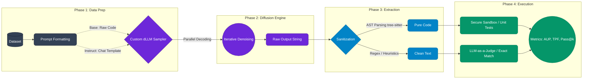
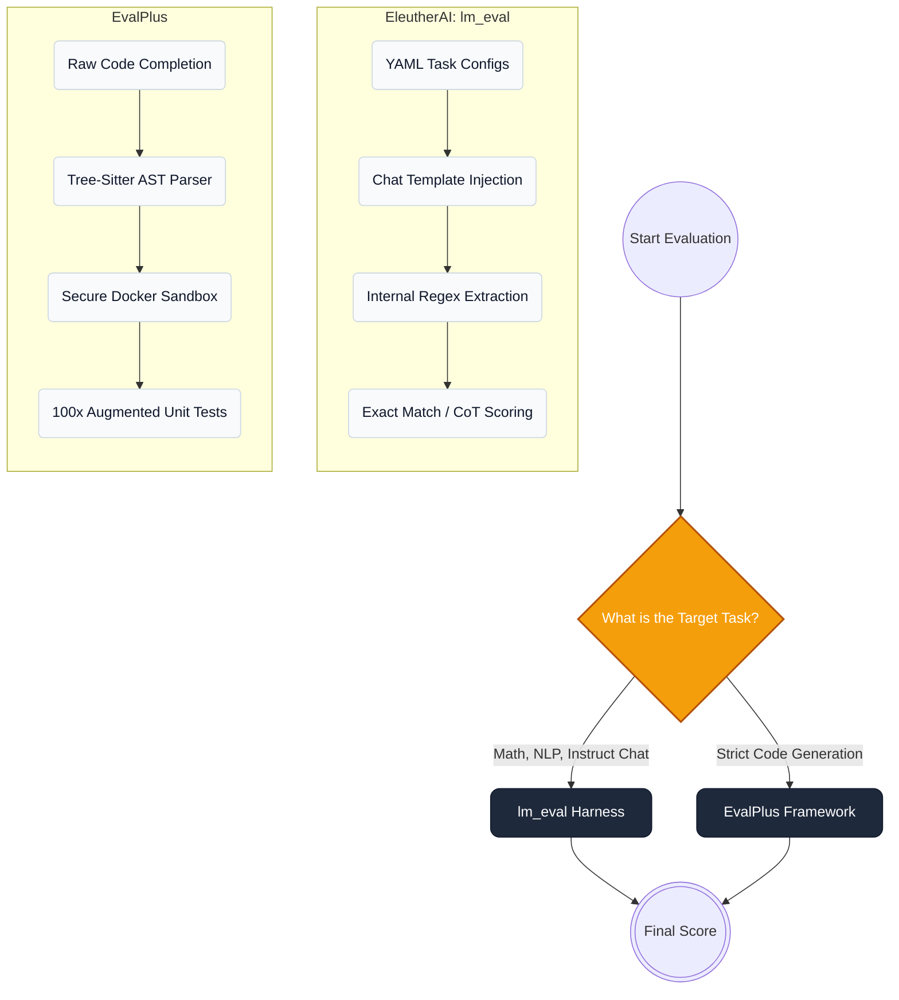

# Tips for Diffusion LLM Inference Accuracy Evaluation

While AR models predict text strictly left-to-right, one token at a time, **dLLMs generate text via iterative denoising and parallel decoding**. Because of this bidirectional generation , dLLMs lack the strict, natural stopping mechanisms of AR models. They frequently hallucinate trailing prose, format markdown unpredictably, or bleed logic across boundaries. And this is one of the major cause of why performance of diffusion LLM is relatively poor in coding task than those autoregressive model

Consequently, traditional AR evaluation loops will often fail a highly intelligent dLLM simply because of formatting artifacts. To obtain scientifically valid metrics, you must structure your evaluation pipeline to isolate the dLLM's true logic from its denoising artifacts.

------

## 1. The Four-Stage dLLM Evaluation Pipeline

To reliably evaluate a dLLM, your architecture must be strictly decoupled into four phases. You cannot simply use `model.generate()` and check if the output matches a string.

Code snippet

### The Logical Flow:

1. **Data Prep (Load):** Datasets must be routed based on the model's training. Base models receive raw headers (e.g., `def fibonacci(n):`); Instruct models must have their prompts wrapped in specific chat templates.
2. **Diffusion Engine (Generate):** The prompt is passed to the custom masked diffusion sampler (e.g., Fast-dLLM v2's block-wise diffusion). This is where caching mechanisms and confidence thresholds (`threshold=1.0`) are applied.
3. **Extraction (Sanitize):** Because dLLMs update tokens globally, they often generate conversational English *after* the correct answer, which crashes standard execution scripts. This phase forcefully isolates the valid logic.
4. **Execution (Post-Evaluation):** The sanitized logic is executed against augmented unit tests or evaluated via strict metrics.

------

## 2. Choosing the Right Evaluation Framework

In dLLM research, pure generative accuracy is the consensus metric. AR-centric metrics like perplexity or `loglikelihood_rolling` do not map cleanly to diffusion trajectories. The industry relies on two primary frameworks, chosen based on the task type.

Code snippet

### 1. `lm_eval` (The Generalist & Chat Framework)

- **Best For:** GSM8K, MATH, IFEval, and Instruct-tuned models (e.g., LLaDA-Instruct).
- **How it Works:** Driven entirely by modular YAML files. It natively handles conversational formatting via the `--apply_chat_template` flag.
- **dLLM Integration:** You create a Python wrapper (e.g., `eval_llada.py`) that subclasses the Hugging Face `AutoModel` and monkey-patches the `.generate()` method with your custom diffusion sampler. `lm_eval` handles the rest.

### 2. EvalPlus (The Code Execution Sandbox)

- **Best For:** HumanEval, MBPP, and evaluating Base (non-instruct) models.
- **The AST Advantage:** EvalPlus relies on `tree-sitter` (an Abstract Syntax Tree parser). If a dLLM outputs a perfect function but appends an invalid string like *"Hope this helps!"* at the end, `tree-sitter` maps the syntax tree, identifies where the valid Python ends, and cleanly amputates the hallucinated prose.
- **The Sandbox:** It safely executes the extracted code against an augmented test suite (`HumanEval+`) that contains 100x more hidden edge cases than the original dataset.

------

## Navigating Dataset Nomenclature: Which Version Do I Load?

A common stumbling block in evaluation is the dizzying array of dataset suffixes. Here is the precise terminology used in the `lm_eval` registry:

- **The Base Dataset (`humaneval` / `mbpp`):** For HumanEval, the prompt is purely a function signature and a docstring. Tests **Code Completion**.
- **The Instruct Variant (`humaneval_instruct` / `mbpp_instruct`):** Modified prompts explicitly telling the model to act as an assistant. Tests **Function Generation**.
- **The `_64` Variant (Pass@k):** Forces the dLLM to generate 64 distinct trajectories. If *at least one* passes, the model scores a 1.0. Tests raw algorithmic capability.
- **The `_plus` Variant (EvalPlus):** Uses mutation fuzzing to generate **hundreds** of hidden edge-case unit tests.

### 🚨 The "Double-Wrap" Trap (Crucial for dLLMs)

When reading papers like **d3LLM**, you will see they evaluated on "HumanEval-Instruct". However, **they do not load the `humaneval_instruct` dataset.**

Instead, the standard practice is to load the base `humaneval` dataset and pass the `--apply_chat_template` flag in the CLI.

- **The Trap:** If you load `humaneval_instruct` *and* pass `--apply_chat_template`, you wrap an instruction inside another instruction template. This destroys the bidirectional attention context in diffusion models and artificially tanks your accuracy scores.

## 3. Code Structure & Scalability Best Practices

When building an evaluation suite for experimental models, tightly coupling your generation logic with the evaluation framework creates technical debt. Follow these architectural rules:

1. **Decouple the API:** Use a wrapper script. Your main entry point should import the model, apply the custom diffusion sampler via a decorator or `types.MethodType`, and expose a standard API that frameworks like `lm_eval` can call blindly.
2. **Avoid Global System Prompts:** Do not inject Chain-of-Thought ("Please think step by step") globally via bash flags. While it boosts Math and Code scores, it will completely destroy strict-formatting benchmarks like **IFEval**.
3. **Use Custom YAMLs:** Instead of global flags, copy the target dataset's YAML file locally and embed your system instructions directly into its `doc_to_text` field.

------

## 4. Prompting Pitfalls (The Chat Template Trap)

The most common reason researchers fail to replicate baseline dLLM scores is prompt misalignment. You must know whether you are evaluating *Code Completion* or *Function Generation*.

- **Base Models (Code Completion):** Use the base dataset (e.g., `humaneval`). Feed the model the exact function signature. **Do not** apply a chat template.
- **Instruct Models (Function Generation):** Apply `--apply_chat_template`. The model acts as a chatbot and writes the function from a blank slate.

🚨 **The "Double-Wrap" Trap:** If you use an "instruct" dataset (which already contains conversational text natively) *and* pass the `--apply_chat_template` flag, you will wrap a chat template inside another chat template. This disrupts the dLLM's bidirectional attention mechanisms and severely degrades generation quality.

