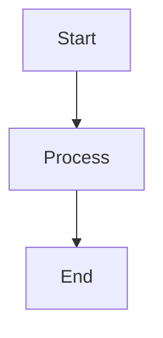

# MD to MDX Compiler

A powerful and extensible Markdown to MDX compiler with support for mermaid diagrams, math expressions, images, and tables. Transform your standard Markdown files into MDX format automatically while preserving all content and adding enhanced features.

## Features

- 🚀 **Automatic Compilation**: Seamlessly converts `.md` files to `.mdx` format
- 🎨 **Mermaid Diagrams**: Interactive diagrams with zoom and fullscreen capabilities
- 🧮 **Math Expressions**: LaTeX/KaTeX support for inline and display math
- 🖼️ **Smart Image Processing**: Automatic image detection and optimization
- 📊 **Enhanced Tables**: Responsive tables with improved styling
- ⚡ **Performance Optimized**: Parallel processing and incremental compilation
- 🔧 **Extensible**: Plugin system for custom processors
- 🔥 **Hot Reload**: Development-friendly file watching
- 📦 **Framework Agnostic**: Works with Astro, Next.js, Vite, and more

## Installation

```bash
npm install @kiro/md-to-mdx
```

## Quick Start

### Programmatic Usage

```javascript
const { MDToMDXCompiler } = require('@kiro/md-to-mdx');

// Create compiler instance
const compiler = new MDToMDXCompiler({
  contentDir: './content',
  outputDir: './src/content'
});

// Compile all files
const result = await compiler.compileAll();
console.log(`Compiled ${result.summary.success} files successfully`);
```

### CLI Usage

```bash
# Install globally for CLI access
npm install -g @kiro/md-to-mdx

# Compile all .md files in current directory
md-to-mdx compile

# Watch for changes during development
md-to-mdx watch --input ./content --output ./src/content

# Show help
md-to-mdx --help
```

## Framework Integration

### Astro

```javascript
// astro.config.mjs
import { createMDToMDXPlugin } from '@kiro/md-to-mdx';

export default defineConfig({
  integrations: [
    createMDToMDXPlugin({
      contentDir: 'src/content',
      processors: {
        mermaid: { enabled: true },
        math: { enabled: true },
        tables: { enabled: true }
      }
    })
  ]
});
```

### Next.js

```javascript
// next.config.js
const { createMDToMDXPlugin } = require('@kiro/md-to-mdx');

module.exports = {
  webpack: (config) => {
    config.plugins.push(
      createMDToMDXPlugin({
        contentDir: './content',
        outputDir: './src/content'
      })
    );
    return config;
  }
};
```

### Vite

```javascript
// vite.config.js
import { createMDToMDXPlugin } from '@kiro/md-to-mdx';

export default {
  plugins: [
    createMDToMDXPlugin({
      contentDir: './content',
      outputDir: './src/content'
    })
  ]
};
```

## Configuration

### Default Configuration

```javascript
const defaultConfig = {
  // Input/Output paths
  contentDir: 'src/content',
  outputDir: 'src/content',
  
  // File patterns
  include: ['**/*.md'],
  exclude: ['**/node_modules/**', '**/.git/**'],
  
  // Processing options
  processors: {
    standard: {
      enabled: true,
      preserveAllElements: true
    },
    mermaid: {
      enabled: true,
      componentPath: '../../components/Mermaid.astro'
    },
    math: {
      enabled: true,
      inlineDelimiters: ['$', '$'],
      displayDelimiters: ['$$', '$$']
    },
    tables: {
      enabled: true,
      addResponsiveClasses: true
    },
    images: {
      enabled: true,
      autoDetect: true
    }
  },
  
  // Performance options
  maxConcurrency: 4,
  batchSize: 10,
  
  // Development options
  watch: true,
  hotReload: true
};
```

### Custom Configuration

Create a `.mdxrc.js` file in your project root:

```javascript
module.exports = {
  contentDir: './content',
  outputDir: './src/content',
  processors: {
    mermaid: {
      enabled: true,
      componentPath: './components/CustomMermaid.jsx'
    },
    math: {
      enabled: true,
      inlineDelimiters: ['\\(', '\\)'],
      displayDelimiters: ['\\[', '\\]']
    }
  }
};
```

## Processors

### Standard Processor

Preserves all standard Markdown elements:
- Headers (`# ## ###`)
- Lists (ordered and unordered)
- Links and images
- Emphasis (bold, italic)
- Code blocks and inline code
- Blockquotes and horizontal rules

### Mermaid Processor

Transforms mermaid code blocks into interactive components:

```markdown

```

Becomes:

```jsx
<Mermaid code={`
graph TD
    A[Start] --> B[Process]
    B --> C[End]
`} />
```

### Math Processor

Handles LaTeX math expressions:

```markdown
Inline math: $E = mc^2$

Display math:
$$
\int_{-\infty}^{\infty} e^{-x^2} dx = \sqrt{\pi}
$$
```

### Table Processor

Enhances Markdown tables with responsive styling:

```markdown
| Name | Age | City |
| ---- | --- | ---- |
| John | 30  | NYC  |
| Jane | 25  | LA   |
```

### Image Processor

Automatically processes images with optimization and responsive features.

## Custom Processors

Create custom processors to extend functionality:

```javascript
class CustomProcessor {
  constructor(options = {}) {
    this.name = 'custom';
    this.priority = 100;
    this.enabled = options.enabled !== false;
  }

  async process(content, context) {
    // Your custom processing logic
    return {
      content: processedContent,
      success: true
    };
  }
}

// Register the processor
const compiler = new MDToMDXCompiler();
compiler.transformer.addProcessor(new CustomProcessor());
```

## API Reference

### MDToMDXCompiler

Main compiler class for orchestrating the compilation process.

#### Constructor

```javascript
new MDToMDXCompiler(config)
```

#### Methods

- `initialize()` - Initialize the compiler
- `compileAll()` - Compile all .md files
- `compileFile(fileData)` - Compile a single file
- `startWatching()` - Start file watching for development
- `getStats()` - Get compiler statistics
- `destroy()` - Clean up resources

### Utility Functions

- `createCompiler(config)` - Create a new compiler instance
- `compileAll(config)` - One-shot compilation with cleanup
- `loadConfig(userConfig)` - Load and validate configuration

## CLI Commands

### compile

Compile all .md files to .mdx format.

```bash
md-to-mdx compile [options]

Options:
  -i, --input <dir>     Input directory (default: current directory)
  -o, --output <dir>    Output directory (default: same as input)
  -c, --config <file>   Configuration file path
  --parallel <num>      Number of parallel processes (default: 4)
  --verbose             Enable verbose logging
```

### watch

Watch for file changes and compile automatically.

```bash
md-to-mdx watch [options]

Options:
  -i, --input <dir>     Input directory to watch
  -o, --output <dir>    Output directory
  -c, --config <file>   Configuration file path
  --debounce <ms>       Debounce delay in milliseconds (default: 300)
```

### init

Initialize a new project with example configuration.

```bash
md-to-mdx init [options]

Options:
  --framework <name>    Target framework (astro, nextjs, vite)
  --typescript          Generate TypeScript configuration
```

## Performance

The compiler is optimized for performance with several features:

- **Parallel Processing**: Process multiple files concurrently
- **Incremental Compilation**: Only recompile changed files
- **Memory Optimization**: Efficient handling of large files
- **Content Caching**: Cache processed content to avoid reprocessing
- **Performance Monitoring**: Built-in performance metrics

### Performance Monitoring

```javascript
const result = await compiler.compileAll();
console.log(result.performance);
// {
//   totalTime: 1234,
//   filesProcessed: 50,
//   averageTime: 24.68,
//   memoryUsage: { ... }
// }
```

## Troubleshooting

### Common Issues

1. **Files not being processed**
   - Check include/exclude patterns
   - Verify file permissions
   - Ensure files have `.md` extension

2. **Mermaid diagrams not rendering**
   - Verify mermaid syntax
   - Check component path configuration
   - Ensure Mermaid component is available

3. **Math expressions not working**
   - Check delimiter configuration
   - Verify LaTeX syntax
   - Ensure KaTeX is installed in your project

4. **Performance issues**
   - Reduce `maxConcurrency` setting
   - Enable incremental compilation
   - Use `exclude` patterns for unnecessary files

### Debug Mode

Enable debug logging for troubleshooting:

```javascript
const compiler = new MDToMDXCompiler({
  debug: true,
  logLevel: 'debug'
});
```

Or via CLI:

```bash
md-to-mdx compile --verbose --debug
```

## Contributing

We welcome contributions! Please see our [Contributing Guide](CONTRIBUTING.md) for details.

### Development Setup

```bash
# Clone the repository
git clone https://github.com/kiro-dev/md-to-mdx.git
cd md-to-mdx

# Install dependencies
npm install

# Run tests
npm test

# Build the package
npm run build
```

## License

MIT License - see [LICENSE](LICENSE) file for details.

## Changelog

See [CHANGELOG.md](CHANGELOG.md) for version history and changes.

## Support

- 📖 [Documentation](https://github.com/kiro-dev/md-to-mdx/wiki)
- 🐛 [Issue Tracker](https://github.com/kiro-dev/md-to-mdx/issues)
- 💬 [Discussions](https://github.com/kiro-dev/md-to-mdx/discussions)
- 📧 [Email Support](mailto:support@kiro.dev)