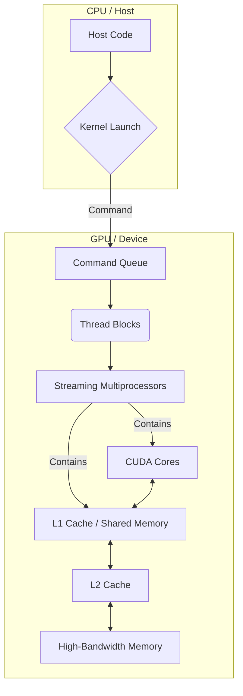
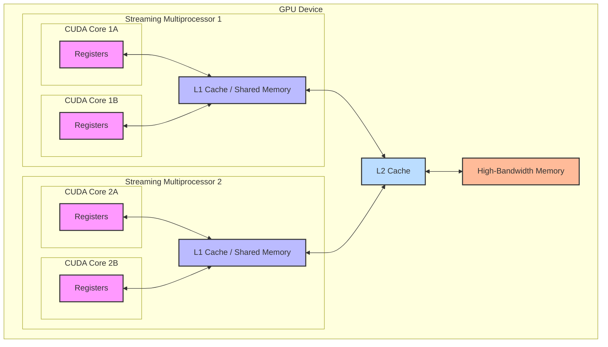
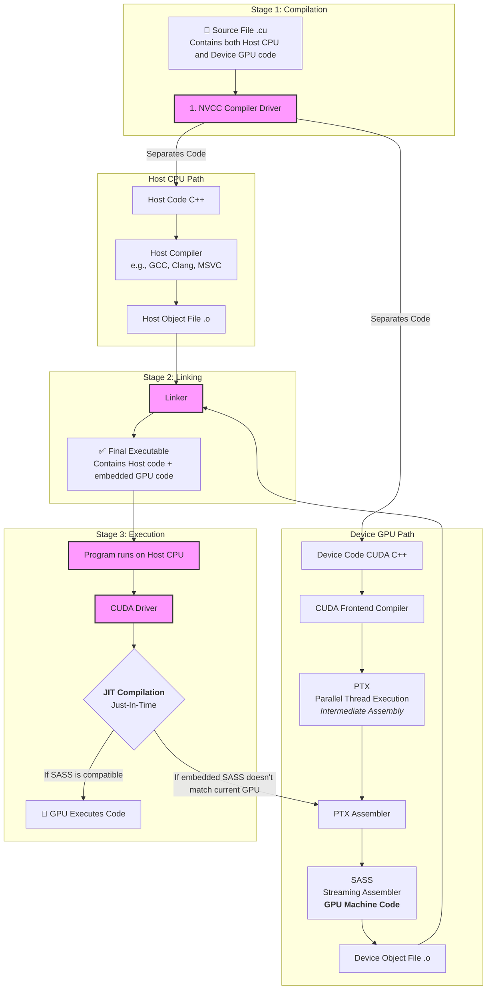

As the most important operation in GPU computation, matrix multiplication optimization is a must learn! 


**Bruh, let's dive right in ~**

## From the architecture to the idea

### Memory Architecture of GPU



1. Command from CPU: CPU will run a pointer to the compiled GPU function. *But how is it compiled, and what needs to be included? This will be discussed in the compilation part.*
2. Then, the command will undergo an asynchronous operation using a physical memory buffer FIFO. Compile instructions will be loaded. 
3. Here, the grid of blocks is simply a soft level abstraction. The information about the grid blocks will be compiled for each thread block, which is in the SMs (Streaming Multiprocessor). ***<u>This is incredible, frontend and backend separation techniques, I guess it helps the hardware security.</u>***
4. **<u>VRAM</u>** is basically a more general external memory, and **<u>HBM</u>** is just a high-performance type.
5. Then, for the SM, it will manage warp, which manages 32 threads for executing and transporting information to other parts:




AND there are their properties:

| Memory Hardware                        | Key Parameters                                               | Primary Job                                                  |
| -------------------------------------- | ------------------------------------------------------------ | ------------------------------------------------------------ |
| **Registers**                          | **Size:** Tiniest (bytes per thread)<br />**Speed:** Instantaneous **Scope:** Private to **one thread** | Holds the immediate working data for a single thread's current instruction. The absolute fastest memory available. |
| **L1 Cache / Shared Memory**           | **Size:** Small (~100 KB per SM) <br />**Speed:** Fastest <br />**Scope:** Per SM | A high-speed scratchpad for threads within a **block** to share data and cooperate. |
| **L2 Cache**                           | **Size:** Medium (a few MB) <br />**Speed:** Fast<br />**Scope:** Shared by **all SMs** | A unified cache for the entire GPU, catching data requests that miss L1 to avoid slow HBM access. |
| **High-Bandwidth Memory (HBM) / VRAM** | **Size:** Large (many GB) **Speed:** Slowest **Scope:** Global (entire GPU) | The main data storage for the GPU, holding all large datasets, textures, and models. |

### Compilation architecture




1. Command from CPU: The command will be compiled in the CPU. The kernel function should include the behavior of the Grid of Blocks and the number of threads per block.
2. **<u>JIT (just in time)</u>** means it compiles the program, not before, but during the GPU's execution.
3. **<u>Bank conflict:</u>** since multiple threads can potentially want to access the same shared memory bank (a column) simultaneously, we would have to serialize them / or arrange the data properly
4. **<u>PTX</u>** provides forward compatibility, and **<u>SASS</u>** provides the maximum performance.
5. **<u>Memory coalescing</u>**: When a warp accesses the GPU's main VRAM, the hardware checks the addresses they are requesting. If these addresses are close together and fall within a single, aligned memory segment, the GPU "coalesces" them. Instead of performing 32 small, separate memory fetches, it performs one single, large fetch that grabs all the requested data at once. Shared Memory/registers are fast enough, and L1/L2 also have this feature called locality.

## Torch Implementation of Matrix Multiplication

```python
def matrix_multilication(x,y):
  # consider matrix x and y with dimention M,N,K
  M,N = x.shape
  N,K = y.shape
  accumulator = torch.zeros(M,K)
  for row_x in range(M):
    for col_y in range(K):
      dot_product = torch.dot(x[row_X,:],y[:,col_y])
      accumulator[row_x][col_y] = dot_product
	return accumulator
# Basically just use
result = torch.matmul(x,y)
```

## High-Level Implementation of Matrix Multiplication

```python
#Implement the tiling in the Triton
def matrix_multiplication(x,y,BLOCK_SIZE_M,BLOCK_SIZE_N,BLOCK_SIZE_K):
  M,N = x.shape
  N,K = y.shape
  z = torch.zeros(M,K)
  for m in range(0,M,BLOCK_SIZE_M):
  	for k in range(0,K,BLOCK_SIZE_K):
      accumulator = zeros((BLOCK_SIZE_M,BLOCK_SIZE_K),dtype=float32)
      #in the SM So we have to export the ACCU to the L2 first
      for i in range(0,n,BLOCK_SIZE_N):
        a = x[m:m+BLOCK_SIZE_M,n:n+BLOCK_SIZE_N]
        b = y[n:n+BLOCK_SIZE_N,k:k+BLOCK_SIZE_K]
        accumulator += dot(a,b)
      z[m:m+BLOCK_SIZE,k:k+BLOCK_SIZE_K] = accumulator
  return z
```

Here are some useful insights:

- Why do we use the accumulator? Why can't we just add to the output matrix? A: Because of the coalescing the access to the information is faster
- Why do we do a small matrix multiplication instead of a faster dot product? A: They are essentially the same because they are just 1D arrays in the memory space, and the difference between these two algorithms won't make much of a difference.

## Triton Kernel for Matrix Multiplication

```python
@triton.jit
def kernel_maxmul(
        # Pointers to matrices
        a_ptr, b_ptr, c_ptr,
        # Matrix dimensions
        M, N, K,
        # The stride variables represent how much to increase the ptr by when moving by 1
        stride_am, stride_ak,
        stride_bk, stride_bn,
        stride_cm, stride_cn,
        # Meta-parameters
        BLOCK_SIZE_M: tl.constexpr, BLOCK_SIZE_N: tl.constexpr, BLOCK_SIZE_K: tl.constexpr,  # for tiling
        GROUP_SIZE_M: tl.constexpr,  # for super band
        ACTIVATION: tl.constexpr  )

    # This is done in a grouped ordering to promote L2 data reuse.(exactly why we use the GROUP_SIZE_M)
    pid = tl.program_id(axis=0)
    num_pid_m = tl.cdiv(M, BLOCK_SIZE_M)
    num_pid_n = tl.cdiv(N, BLOCK_SIZE_N)
    num_pid_in_group = GROUP_SIZE_M * num_pid_n
    group_id = pid // num_pid_in_group
    first_pid_m = group_id * GROUP_SIZE_M
    group_size_m = min(num_pid_m - first_pid_m, GROUP_SIZE_M)
    pid_m = first_pid_m + ((pid % num_pid_in_group) % group_size_m)
    pid_n = (pid % num_pid_in_group) // group_size_m

    # ------------------------------------------------------
    # This helps to guide integer analysis in the backend to optimize load/store offset address calculation
    tl.assume(pid_m >= 0)
    tl.assume(pid_n >= 0)
    tl.assume(stride_am > 0)
    tl.assume(stride_ak > 0)
    tl.assume(stride_bn > 0)
    tl.assume(stride_bk > 0)
    tl.assume(stride_cm > 0)
    tl.assume(stride_cn > 0)

    # ----------------------------------------------------------
    # Create pointers for the first blocks of A and B.
    offs_am = (pid_m * BLOCK_SIZE_M + tl.arange(0, BLOCK_SIZE_M)) % M
    offs_bn = (pid_n * BLOCK_SIZE_N + tl.arange(0, BLOCK_SIZE_N)) % N
    offs_k = tl.arange(0, BLOCK_SIZE_K)
    a_ptrs = a_ptr + (offs_am[:, None] * stride_am + offs_k[None, :] * stride_ak)
    b_ptrs = b_ptr + (offs_k[:, None] * stride_bk + offs_bn[None, :] * stride_bn)

    # -----------------------------------------------------------
    # Iterate to compute a block of the C matrix.
    # We accumulate into a `[BLOCK_SIZE_M, BLOCK_SIZE_N]` block
    # of fp32 values for higher accuracy.
    # `accumulator` will be converted back to fp16 after the loop.
    accumulator = tl.zeros((BLOCK_SIZE_M, BLOCK_SIZE_N), dtype=tl.float32)
    for k in range(0, tl.cdiv(K, BLOCK_SIZE_K)):
        # Load the next block of A and B, generate a mask by checking the K dimension.
        # If it is out of bounds, set it to 0.
        a = tl.load(a_ptrs, mask=offs_k[None, :] < K - k * BLOCK_SIZE_K, other=0.0)
        b = tl.load(b_ptrs, mask=offs_k[:, None] < K - k * BLOCK_SIZE_K, other=0.0)
        # We accumulate along the K dimension.
        accumulator = tl.dot(a, b, accumulator)
        # Advance the ptrs to the next K block.
        a_ptrs += BLOCK_SIZE_K * stride_ak
        b_ptrs += BLOCK_SIZE_K * stride_bk
    # You can fuse arbitrary activation functions here
    # while the accumulator is still in FP32!
    if ACTIVATION == "leaky_relu":
        accumulator = leaky_relu(accumulator)
    c = accumulator.to(tl.float16)

    # -----------------------------------------------------------
    # Write back the block of the output matrix C with masks.
    offs_cm = pid_m * BLOCK_SIZE_M + tl.arange(0, BLOCK_SIZE_M)
    offs_cn = pid_n * BLOCK_SIZE_N + tl.arange(0, BLOCK_SIZE_N)
    c_ptrs = c_ptr + stride_cm * offs_cm[:, None] + stride_cn * offs_cn[None, :]
    c_mask = (offs_cm[:, None] < M) & (offs_cn[None, :] < N)
    tl.store(c_ptrs, c, mask=c_mask)

```

- We used a novel parameter: GROUP_SIZE_M, which was meant to be the height of a super-block with several BLOCK_SIZE_M tall. The following picture shows this idea better. Let me use the quote from the original tutorial <u>*"In the following matmul where each matrix is 9 blocks by 9 blocks, we can see that if we compute the output in row-major ordering, we need to load 90 blocks into SRAM to compute the first 9 output blocks, but if we do it in grouped ordering, we only need to load 54 blocks."*</u>

## 


## Conclusion

GPU performance is dictated by its memory hierarchy: extremely fast but small on-chip memory (Registers, L1 Cache/Shared Memory) and large but slow off-chip memory (VRAM/HBM). The primary optimization goal is to minimize traffic to slow VRAM by maximizing data reuse in the fast caches.

The key software strategy is **tiling** (or blocking), where large matrices are broken into smaller blocks that fit into fast on-chip memory. Computations are performed on these blocks using a local **accumulator** to sum results, ensuring only one final, slow write to VRAM per block. This algorithm must also account for hardware features, ensuring memory access is **coalesced** to maximize VRAM bandwidth and that it avoids **bank conflicts** in shared memory.

Block Tiling also works ! And it fosters the calculation speed.


