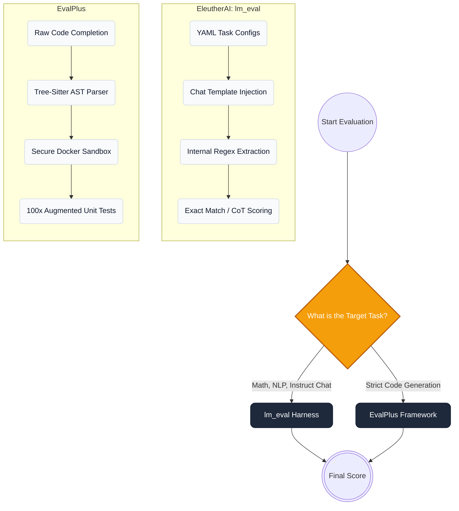

Unlike autoregressive (AR) models that generate left-to-right, diffusion LLMs (dLLMs) denoise in parallel. That bidirectional process lacks a natural stop signal, so outputs can trail into extra prose, malformed markdown, or boundary bleed. As a result, AR-style evaluation loops often penalize correct logic in coding tasks. The pipeline below isolates a dLLM's true reasoning from denoising artifacts so metrics reflect capability, not formatting noise.

---

## 1. The Four-Stage dLLM Evaluation Pipeline

To evaluate a dLLM reliably, split the system into four phases. Avoid the naive pattern of `model.generate()` + string matching.

```mermaid
graph LR
    subgraph Phase 1: Data Prep
        A[(Dataset)] --> B[Prompt Formatting]
        B -.-> |Base: Raw Code| C
        B -.-> |Instruct: Chat Template| C
    end

    subgraph Phase 2: Diffusion Engine
        C{Custom dLLM Sampler} -->|Parallel Decoding| D((Iterative Denoising))
        D --> E[Raw Output String]
    end

    subgraph Phase 3: Extraction
        E --> F{Sanitization}
        F -->|AST parsing (tree-sitter)| G[Pure Code]
        F -->|Regex / Heuristics| H[Clean Text]
    end

    subgraph Phase 4: Execution
        G --> I[Secure Sandbox / Unit Tests]
        H --> J[LLM-as-a-Judge / Exact Match]
        I --> K((Metrics: AUP, TPF, Pass@k))
        J --> K
    end

    %% Styling
    classDef data fill:#334155,stroke:#0f172a,color:#fff,rx:8px,ry:8px
    classDef engine fill:#6d28d9,stroke:#4c1d95,color:#fff,rx:8px,ry:8px
    classDef extract fill:#0284c7,stroke:#0369a1,color:#fff,rx:8px,ry:8px
    classDef exec fill:#059669,stroke:#047857,color:#fff,rx:8px,ry:8px
    
    class A,B data
    class C,D,E engine
    class F,G,H extract
    class I,J,K exec
```

### The Logical Flow

1. **Data prep (load):** Route datasets based on training. Base models receive raw headers (e.g., `def fibonacci(n):`); instruct models require chat templates.
2. **Diffusion engine (generate):** Pass the prompt to your masked diffusion sampler (e.g., block-wise diffusion). Apply caching and confidence thresholds (e.g., `threshold=1.0`).
3. **Extraction (sanitize):** Because dLLMs update tokens globally, they often append conversational prose after the correct answer. This phase isolates valid logic.
4. **Execution (post-eval):** Execute sanitized code against augmented unit tests or score text with strict metrics.

---

## 2. Choosing the Right Evaluation Framework

In dLLM research, generative accuracy is the primary metric. AR-centric metrics like perplexity or `loglikelihood_rolling` do not map cleanly to diffusion trajectories. Two frameworks dominate, chosen by task type.



### 2.1 `lm_eval` (Generalist & Chat Framework)

- **Best for:** GSM8K, MATH, IFEval, and instruct-tuned models (e.g., LLaDA-Instruct).
- **How it works:** Modular YAML tasks with optional chat formatting via `--apply_chat_template`.
- **dLLM integration:** Write a wrapper (e.g., `eval_llada.py`) that subclasses Hugging Face `AutoModel` and monkey-patches `.generate()` with your diffusion sampler.

### 2.2 EvalPlus (Code Execution Sandbox)

- **Best for:** HumanEval, MBPP, and evaluating base (non-instruct) models.
- **AST advantage:** EvalPlus uses `tree-sitter` to locate valid code even if the model appends text like "Hope this helps!".
- **Sandbox:** Executes against `HumanEval+` with 100x augmented unit tests.

---

## 3. Navigating Dataset Nomenclature

Dataset suffixes are easy to mix up. Here is the typical `lm_eval` terminology:

- **Base dataset (`humaneval` / `mbpp`):** Prompt is a function signature + docstring. Tests **code completion**.
- **Instruct variant (`humaneval_instruct` / `mbpp_instruct`):** Prompts are framed as assistant instructions. Tests **function generation**.
- **`_64` variant (Pass@k):** Forces 64 trajectories; if any pass, the score is 1.0. Tests raw algorithmic capability.
- **`_plus` variant (EvalPlus):** Adds mutation fuzzing for **hundreds** of hidden edge-case tests.

> [!WARNING]
> The "double-wrap" trap: if you load an instruct dataset **and** pass `--apply_chat_template`, you wrap instructions twice. This breaks diffusion models' bidirectional context and can tank accuracy.

---

## 4. Code Structure & Scalability Best Practices

When building an evaluation suite for experimental models, tightly coupling generation logic with the evaluation framework creates technical debt. Follow these architectural rules:

1. **Decouple the API:** Use a wrapper script. Your main entry point should import the model, apply the custom diffusion sampler via a decorator or `types.MethodType`, and expose a standard API that frameworks like `lm_eval` can call.
2. **Avoid global system prompts:** Do not inject chain-of-thought globally via bash flags. It can boost Math and Code scores but will break strict-formatting benchmarks like **IFEval**.
3. **Use custom YAMLs:** Copy the dataset YAML locally and embed system instructions directly into `doc_to_text` instead of global flags.

---

## 5. Prompting Pitfalls (The Chat Template Trap)

The most common cause of irreproducible dLLM baselines is prompt misalignment.

- **Base models (code completion):** Use the base dataset (e.g., `humaneval`). Feed the model the exact function signature. **Do not** apply a chat template.
- **Instruct models (function generation):** Apply `--apply_chat_template`. The model behaves as a chatbot and writes the function from scratch.

> [!WARNING]
> If you use an instruct dataset **and** pass `--apply_chat_template`, you double-wrap the prompt and distort attention patterns.
