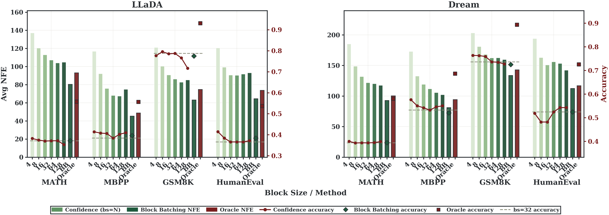
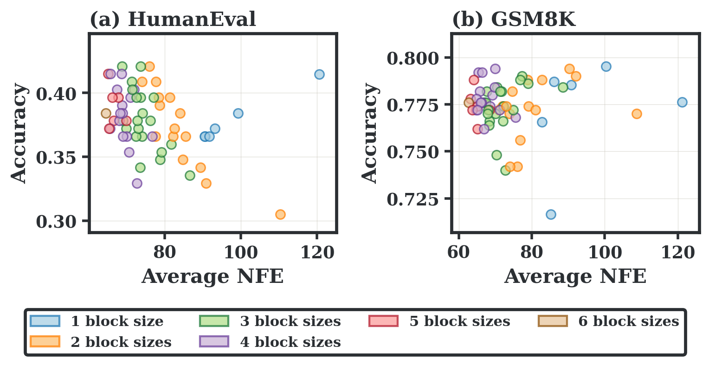

## Overview

Diffusion language models (dLLMs) generate text by iteratively denoising multiple token positions in parallel—an attractive alternative to strictly left-to-right autoregressive decoding. But efficient dLLM inference hinges on one hard tradeoff: **how large should each denoising block be?**

- **Small blocks** preserve local conditioning but require many denoising steps (high NFE cost).
- **Large blocks** expose more parallelism but risk premature token commitments and accumulated KV-cache errors.

Existing systems pick a single block size per request and stick with it, leaving a natural opportunity on the table: different block sizes are not rivals—they are complements. Our key observation is that no single block size is globally optimal across prompts, tasks, or models.

The oracle above—which picks the best block size per prompt—consistently beats any fixed choice, motivating **block size as a per-sample branching dimension** rather than a fixed hyperparameter.

## Key Insight: Block-Size Branches are Complementary

When you run the same request at different block sizes, the resulting KV-cache trajectories are neither identical nor independent. They share an initial prefix, **bifurcate at semantically decisive positions** (where the answer is determined), and later re-agree on syntactically lightweight tokens. This structure means:

1. Branches carry useful information about one another around bifurcation points.
2. Later-stage agreement is concentrated on low-ambiguity tokens, so it's safe to share progress there.
3. Periodic full-sequence refreshes can re-anchor local block updates to a globally consistent KV state without restarting from scratch.

## Method: BlockBatch

BlockBatch instantiates multiple branches with different block sizes (e.g., {4, 8, 16, 32, 64, 128}) for the same request and executes their active windows **inside a single batched model invocation**. Three coordination operations prevent the search from degenerating into stale or diverging trajectories:

### Confidence-Gated Merge

A source branch is *compatible* with a destination branch when all positions decoded in both are identical. For a still-masked position in the destination, BlockBatch accepts a high-confidence token proposal from a compatible source branch only when the destination's own probability map assigns that token confidence above a fixed threshold (0.9). Lagging branches get free progress without being forced to accept tokens inconsistent with their local state.

### Leader-Based Synchronization

When a branch falls too far behind, it copies the sequence state and KV-cache row of a sufficiently advanced "leader" branch, preventing wasted compute on stale trajectories.

### Full-Sequence KV Refresh

Block denoising only updates the active window while relying on cached context elsewhere. This accumulates KV-cache drift over many local steps. Periodic full-sequence refreshes recompute KV states for all active branches, correcting this drift and projecting each branch back onto a model-consistent state manifold.

## Results

We evaluated BlockBatch on three representative dLLMs—**LLaDA-1.5-8B**, **LLaDA-Instruct-8B**, and **Dream-Base-7B**—across four benchmarks: **GSM8K**, **MATH**, **HumanEval**, and **MBPP**.

Key results across all 12 model–task settings:

| Metric                          | Result                              |
| ------------------------------- | ----------------------------------- |
| NFE reduction vs Vanilla        | 47.7–82.3%                          |
| End-to-end speedup vs Vanilla   | 1.7–5.8×                            |
| NFE reduction vs Fast-dLLM      | **26.6% average**, up to 33.6%      |
| Additional speedup vs Fast-dLLM | up to **2.05×**                     |
| Accuracy                        | Preserved across all settings       |

BlockBatch achieves the lowest or tied-lowest NFE in every one of the 12 model–task comparisons, making it the most NFE-efficient method evaluated. Crucially, the accuracy is fully preserved—BlockBatch does not sacrifice answer quality for speed.

## Technical Details

- **Training-free**: BlockBatch requires no fine-tuning or modification to the underlying dLLM weights.
- **Batching shape only**: Each branch owns an independent sequence row and KV-cache row; batching only changes execution shape, not model semantics.
- **NFE accounting**: NFE_total = NFE_init + NFE_block + NFE_refresh — all three phases counted fairly.
- **EOS handling**: If a branch predicts EOS before all preceding positions are decoded, it enters an EOS cycle until the prefix is continuous, preventing premature termination.

## Authors

Xiaoyou Wu, Cheng-Jhih Shih, Binfei Ji, Yong Liu, Yingyan (Celine) Lin

*Georgia Institute of Technology* — submitted to *ACL 2026*
