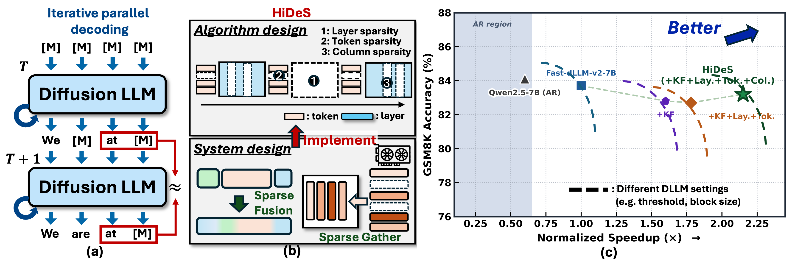
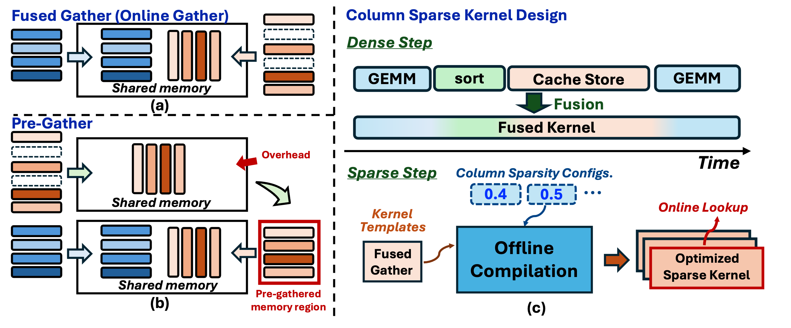
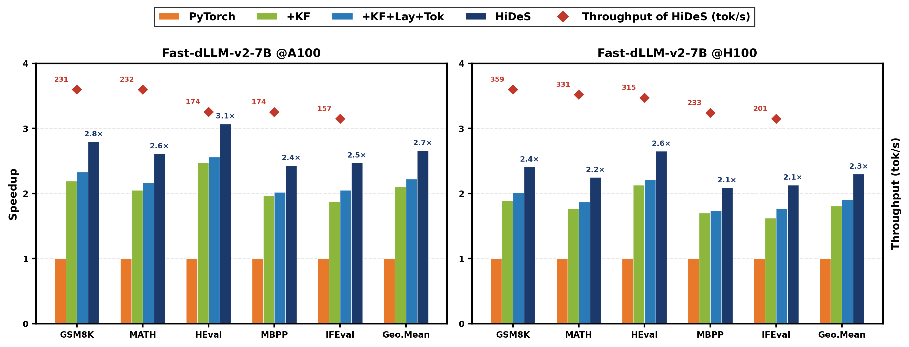

## Overview

Diffusion large language models (DLLMs) replace autoregressive token-by-token decoding with iterative parallel denoising: a block of masked tokens is refined over multiple forward passes until all positions are unmasked. This block-parallel dataflow exposes inference parallelism unavailable to autoregressive decoding, but the central systems question remains — how to reduce the redundant denoising computation so that parallelism yields real end-to-end speedup.

A key structural property of DLLM inference is the high similarity between consecutive denoising steps. This cross-step redundancy appears at three largely independent granularities:

1. **Layers** — entire transformer layers often change little between adjacent steps
2. **Tokens** — within an active layer, only a subset of query-token positions requires fresh computation
3. **Columns** — within the active queries, many attention and FFN columns remain stable across steps

Because these redundancies arise from distinct mechanisms, their savings **compose multiplicatively** — a property HiDeS calls *hierarchical delta sparsity*.

## The Challenge: Composition Without Accuracy Collapse

Existing DLLM acceleration methods target only one reuse axis at a time — layer skipping, token-level caching, or KV/column reuse. Combining them naively fails because errors interact:

- Layer reuse perturbs hidden states seen by downstream token and column selectors
- Token subsetting changes which queries are executed, altering column importance rankings
- Column reuse error accumulates based on whether its inputs are themselves reused

**Challenge 1 (Algorithm):** How to jointly exploit all three granularities while controlling compositional error accumulation across the denoising trajectory?

**Challenge 2 (System):** The resulting workloads are data-dependent and step-varying, producing irregular sparsity patterns that dense GPU kernels cannot translate into latency reduction.

## Algorithm: The Temporal Tree

HiDeS introduces the *temporal tree*, a unified formalism that decomposes DLLM denoising into composable (spatial, temporal) density pairs at each granularity. It instantiates this with:

- **Similarity-guided layer and token selection** — adaptively identifies which layers and token positions are stable enough to skip or reuse
- **Delta-corrected column reuse** — applies a correction term to compensate for approximation error when reusing column-level computations
- **Adaptive refresh scheduling** — controls when each granularity flushes its cached state to prevent error accumulation across the denoising trajectory

## System: Staged Sparse Execution Pipeline

HiDeS develops a staged sparse execution pipeline with three components:

- **Subset–scatter token execution** — executes only the active token subset while preserving full-context bidirectional attention semantics
- **Whole-layer kernel fusion** — eliminates the auxiliary overhead (index computation, memory copies) that would otherwise dominate sparse execution
- **Fused-gather tensor-core kernels** — achieves data-proportional latency scaling in the memory-bound denoising regime, converting FLOP reductions into actual wall-clock speedup

## Results

On Fast-dLLM-v2-7B across five benchmarks (GSM8K, MBPP, HumanEval, MATH, and one additional) on A100 and H100 GPUs:

| Platform | Throughput over dense baseline |
| -------- | ------------------------------ |
| A100     | **2.66×**                      |
| H100     | **2.30×**                      |

HiDeS matches or exceeds AR-model quality at higher throughput, with negligible accuracy loss across all five benchmarks. It also consistently outperforms single-granularity baselines on the accuracy–efficiency frontier.

## Key Insight

The central result is that multi-granularity temporal reuse, when co-designed with sparsity-aware GPU execution, delivers practical end-to-end acceleration for DLLM inference. The multiplicative composition of layer, token, and column savings is not merely additive — the three axes are sufficiently independent that their joint exploitation yields compounding gains that single-axis methods leave on the table.

*Under submission, MICRO 2026*
