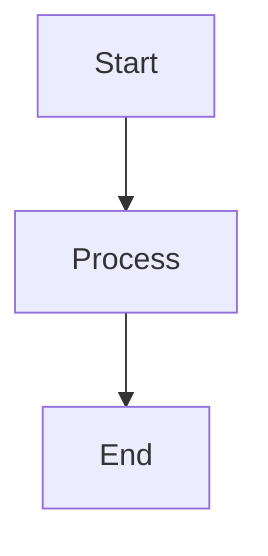

# Remark Typora Plugin Infrastructure

This directory contains the core infrastructure for Typora-compatible remark plugins that enable seamless content creation between Typora and the Astro website.

## Directory Structure

```
src/plugins/remark-typora/
├── index.js                    # Main entry point and exports
├── README.md                   # This documentation
├── test-infrastructure.js      # Infrastructure tests
├── utils/                      # Shared utilities
│   ├── auto-import-manager.js  # Manages automatic component imports
│   ├── ast-utils.js           # AST manipulation utilities
│   └── path-resolver.js       # File path resolution utilities
└── plugins/                   # Individual plugin implementations
    ├── remark-typora-mermaid.js     # Mermaid diagram processing
    ├── remark-typora-images.js      # Image path resolution
    └── remark-typora-extensions.js  # Typora syntax extensions
```

## Core Components

### AutoImportManager

Manages automatic component imports for remark plugins. Tracks which components are used and generates the necessary import statements.

**Key Features:**
- Automatic import statement generation
- Duplicate import prevention
- Usage tracking and statistics
- Support for both default and named imports

**Example Usage:**
```javascript
const manager = new AutoImportManager();
manager.addImport('Mermaid', '../../components/Mermaid.astro');
manager.markAsUsed('Mermaid');
const imports = manager.generateImportStatements();
```

### AstUtils

Provides utilities for manipulating markdown Abstract Syntax Trees (AST).

**Key Features:**
- JSX element creation for MDX
- Node finding and replacement
- Import statement insertion
- AST traversal helpers

**Example Usage:**
```javascript
const jsxElement = AstUtils.createJsxElement('Mermaid', { code: 'graph TD\\n    A --> B' });
AstUtils.insertImports(tree, ['import Mermaid from "../../components/Mermaid.astro";']);
```

### PathResolver

Handles file path resolution using Typora's asset management conventions.

**Key Features:**
- Typora asset folder resolution
- Image path sanitization
- Zoom syntax parsing
- Fallback path strategies

**Example Usage:**
```javascript
const resolver = new PathResolver();
const context = resolver.getProcessingContext('src/content/blog/my-post.md');
const resolution = resolver.resolveImagePath('image.png', context);
```

## Plugin Architecture

Each plugin follows a consistent pattern:

1. **Configuration**: Accepts options with sensible defaults
2. **Processing**: Transforms AST nodes according to Typora conventions
3. **Import Management**: Automatically handles component imports
4. **Error Handling**: Graceful fallbacks for edge cases
5. **Debugging**: Stores processing information in file data

## Available Plugins

### remark-typora-mermaid

Transforms ```mermaid code blocks into Mermaid component JSX elements with comprehensive error handling.

**Features:**
- Detects and transforms ```mermaid code blocks
- Validates mermaid syntax before transformation
- Automatically adds component imports
- Graceful error handling with visual error indicators
- Support for multiple mermaid blocks in single document
- Preserves other code blocks unchanged

**Configuration Options:**
```javascript
{
  componentPath: '../../components/Mermaid.astro',  // Path to Mermaid component
  componentName: 'Mermaid',                         // Component name to use
  preserveCodeBlock: false,                         // Keep original code block
  autoImport: true,                                 // Auto-add imports
  wrapInFigure: false                              // Wrap in figure element
}
```

**Input Example:**
```markdown

```

**Output Example:**
```jsx
import Mermaid from "../../components/Mermaid.astro";

<Mermaid code={`graph TD
    A[Start] --> B[Process]
    B --> C[End]`} />
```

**Error Handling:**
- Invalid syntax creates visual error indicators
- Empty blocks are handled gracefully
- Processing errors are logged and displayed
- Original code is preserved in error cases

### remark-typora-images
Resolves image paths using Typora's asset folder conventions.

### remark-typora-extensions
Handles Typora-specific markdown extensions like highlights and underlines.

## Testing

Run the infrastructure tests to verify everything is working:

```bash
node src/plugins/remark-typora/test-infrastructure.js
```

## Integration

To use these plugins in your Astro configuration:

```javascript
import { 
  remarkTyporaMermaid, 
  remarkTyporaImages, 
  remarkTyporaExtensions 
} from './src/plugins/remark-typora/index.js';

export default defineConfig({
  integrations: [
    mdx({
      remarkPlugins: [
        remarkGfm,
        remarkMath,
        [remarkTyporaMermaid, { componentPath: "../../components/Mermaid.astro" }],
        [remarkTyporaImages, { contentDir: "src/content/blog" }],
        [remarkTyporaExtensions, { enableHighlight: true }]
      ]
    })
  ]
});
```

## Development

When adding new plugins or utilities:

1. Follow the established patterns and naming conventions
2. Add comprehensive error handling
3. Include debugging information in file data
4. Update the main index.js exports
5. Add tests to verify functionality

## Requirements Satisfied

This infrastructure satisfies the following requirements:

- **Requirement 1.1**: Enables ```mermaid code block processing
- **Requirement 3.1**: Maintains backward compatibility with existing content
- **Requirement 3.2**: Handles both old and new syntax gracefully
- **Requirement 3.3**: Provides fallback mechanisms for missing assets

## Security Considerations

- All file paths are sanitized to prevent directory traversal attacks
- Image paths are validated against allowed directories
- Component imports are validated to prevent code injection
- File system operations include proper error handling