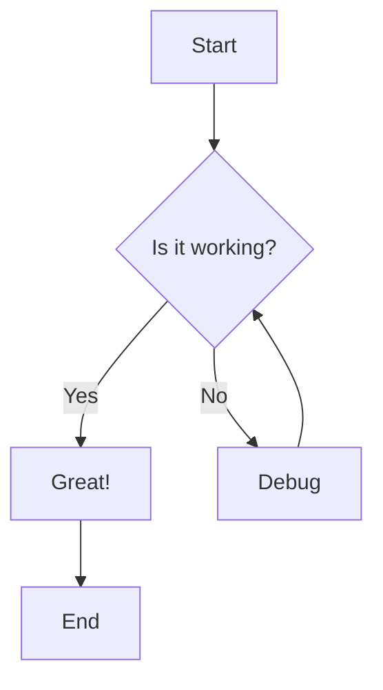
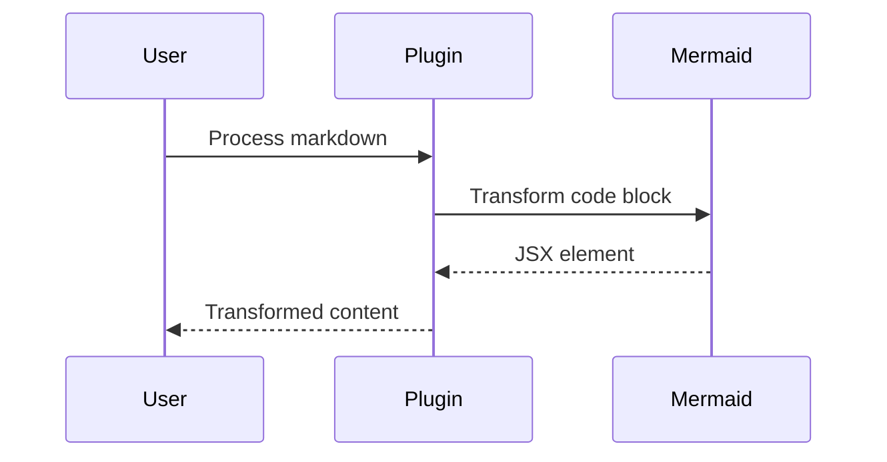
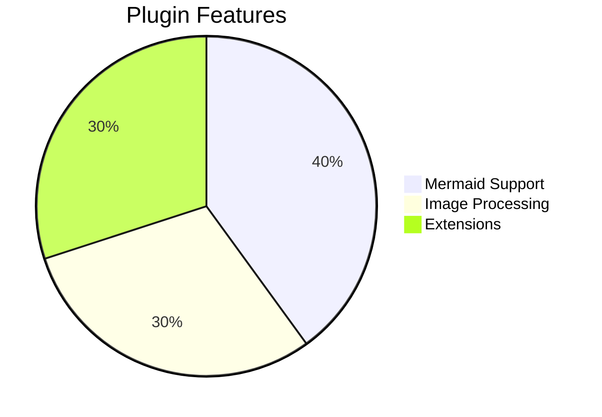
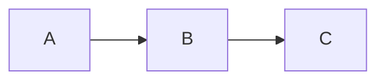

# Mermaid Plugin Demo

This document demonstrates the remark-typora-mermaid plugin functionality.

## Valid Mermaid Diagrams

### Flowchart


### Sequence Diagram


### Pie Chart


## Error Handling

### Invalid Syntax
```mermaid
this is not valid mermaid syntax
```

### Empty Block
```mermaid

```

## Mixed Content

Here's some regular code that should not be transformed:

```javascript
console.log('This should remain as a code block');
```

```python
print("This should also remain as a code block")
```

But this mermaid should be transformed:



## End

The plugin successfully transforms mermaid code blocks while preserving other content.